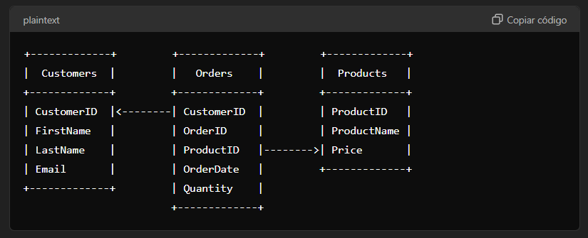

# Class2 - Inner Join

### Criando e Inserindo valores no Banco

Os comandos utilizados para criar o banco e praticar, são:

```
CREATE DATABASE TestDB;
USE TestDB;

CREATE TABLE Customers (    CustomerID INT AUTO_INCREMENT PRIMARY KEY,
    FirstName VARCHAR(50),
    LastName VARCHAR(50),
    Email VARCHAR(100)
);
CREATE TABLE Products (    ProductID INT AUTO_INCREMENT PRIMARY KEY,
    ProductName VARCHAR(100),
    Price DECIMAL(10, 2)
);
CREATE TABLE Orders (    OrderID INT AUTO_INCREMENT PRIMARY KEY,
    CustomerID INT,
    ProductID INT,
    OrderDate DATE,
    Quantity INT,
    FOREIGN KEY (CustomerID) REFERENCES Customers(CustomerID),
    FOREIGN KEY (ProductID) REFERENCES Products(ProductID)
);

INSERT INTO Customers (FirstName, LastName, Email) VALUES('John', 'Doe', 'john.doe@example.com'),
('Jane', 'Smith', 'jane.smith@example.com'),
('Michael', 'Johnson', 'michael.johnson@example.com'),
('Emily', 'Davis', 'emily.davis@example.com'),
('Daniel', 'Brown', 'daniel.brown@example.com');
INSERT INTO Products (ProductName, Price) VALUES('Laptop', 999.99),
('Smartphone', 499.99),
('Tablet', 299.99),
('Headphones', 89.99),
('Smartwatch', 199.99);
INSERT INTO Orders (CustomerID, ProductID, OrderDate, Quantity) VALUES(1, 1, '2023-01-01', 1),
(1, 2, '2023-01-02', 2),
(1, 3, '2023-01-03', 1),
(2, 1, '2023-01-04', 1),
(2, 2, '2023-01-05', 3),
(2, 3, '2023-01-06', 1),
(3, 1, '2023-01-07', 2),
(3, 2, '2023-01-08', 1),
(3, 3, '2023-01-09', 2),
(4, 1, '2023-01-10', 1),
(4, 2, '2023-01-11', 2),
(4, 3, '2023-01-12', 1),
(5, 1, '2023-01-13', 1),
(5, 2, '2023-01-14', 3),
(5, 3, '2023-01-15', 2),
(1, 4, '2023-01-16', 1),
(1, 5, '2023-01-17', 2),
(2, 4, '2023-01-18', 3),
(2, 5, '2023-01-19', 1),
(3, 4, '2023-01-20', 2),
(3, 5, '2023-01-21', 1),
(4, 4, '2023-01-22', 3),
(4, 5, '2023-01-23', 2),
(5, 4, '2023-01-24', 1),
(5, 5, '2023-01-25', 2),
(1, 1, '2023-01-26', 3),
(2, 2, '2023-01-27', 1),
(3, 3, '2023-01-28', 2),
(4, 4, '2023-01-29', 1),
(5, 5, '2023-01-30', 3);
```


### Estrutura do Banco

A estrutura do banco usado para praticar é a seguinte:



###  Exercícios

1 - /*Liste todos os pedidos com os nomes dos clientes e os nomes dos produtos.*/

select customers.FirstName, customers.LastName, products.ProductName from (( Orders
INNER JOIN customers ON Orders.CustomerID = customers.CustomerID)
INNER JOIN products ON Orders.ProductID = products.ProductID)

2 - /*Encontre todos os pedidos feitos por um cliente específico, por exemplo, "John Doe".*/

select orders.OrderID, orders.CustomerID, orders.OrderDate, concat(customers.FirstName, " ", customers.LastName) AS "Full Name" from Orders INNER JOIN customers ON orders.CustomerID = customers.CustomerID WHERE orders.CustomerID = (select customers.CustomerID from customers WHERE  CONCAT(customers.FirstName, " ", customers.LastName) IN ("John Doe"));

/*select customers.CustomerID from customers WHERE  CONCAT(customers.FirstName, " ", customers.LastName) IN ("John Doe");*/

3- Liste todos os produtos que foram pedidos mais de uma vez.

select products.ProductID, products.ProductName, count(orders.ProductID) AS "vezes repetido" from products INNER JOIN orders
ON orders.ProductID = products.ProductID
group by products.ProductID
HAVING
count(orders.ProductID) > 1;
