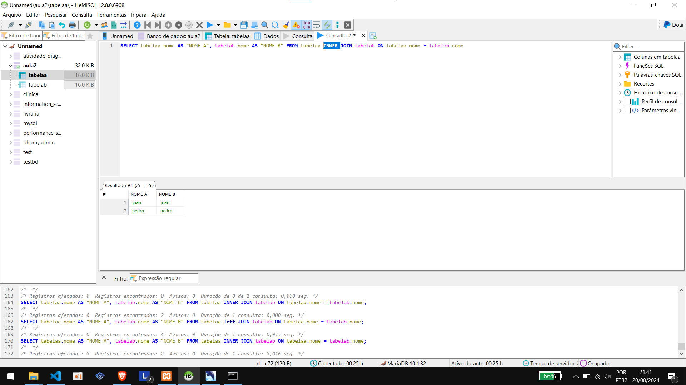
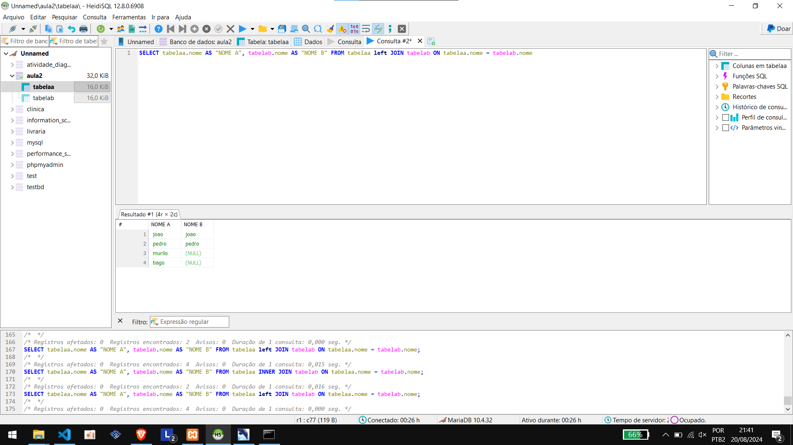
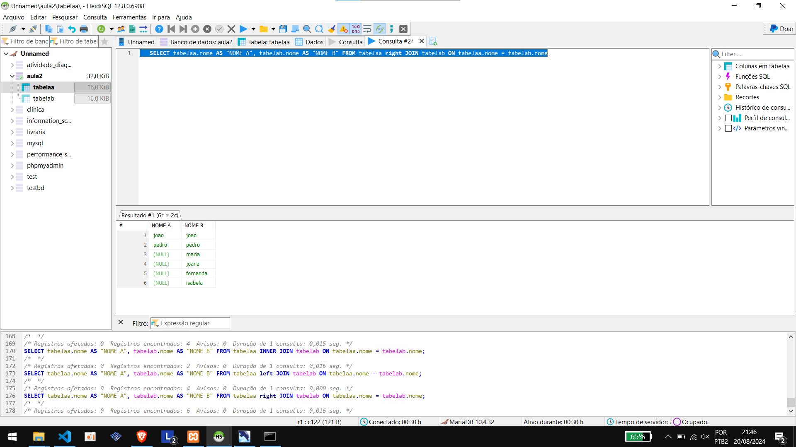
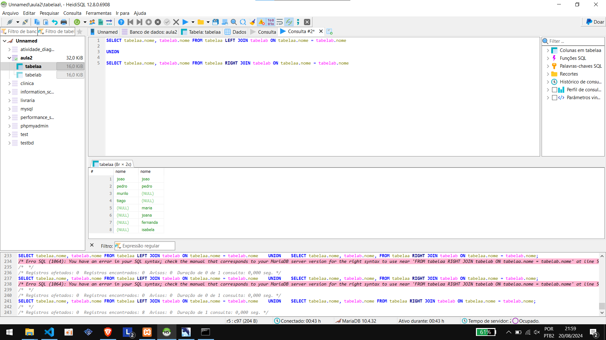

# Join


Sql Join in multiple tables: Venn Diagram. Joins types and multiples commands :


- Inner Join - data on both tables
- Right Join
- Left Join


## Queries in class for practice

The queries above were used in the class to practice and undestand the sql joins:


#### inner join

```sql
SELECT tabelaa.nome AS "NOME A", tabelab.nome AS "NOME B" FROM tabelaa INNER JOIN tabelab ON tabelaa.nome = tabelab.nome
```




#### left join

```sql
SELECT tabelaa.nome AS "NOME A", tabelab.nome AS "NOME B" FROM tabelaa left JOIN tabelab ON tabelaa.nome = tabelab.nome
```




#### right join


```sql
SELECT tabelaa.nome AS "NOME A", tabelab.nome AS "NOME B" FROM tabelaa right JOIN tabelab ON tabelaa.nome = tabelab.nome

```




#### full outer join


```sql
SELECT tabelaa.nome, tabelab.nome FROM tabelaa LEFT JOIN tabelab ON tabelaa.nome = tabelab.nome

UNION

SELECT tabelaa.nome, tabelab.nome FROM tabelaa RIGHT JOIN tabelab ON tabelaa.nome = tabelab.nome
```





Union has another complement, the all command return tuples which repeat itself in both tables
