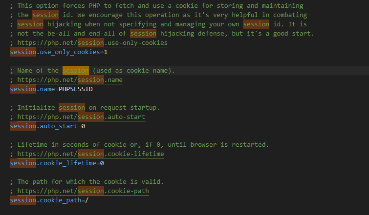

# Sessions

A session serve para guardar informacoes do usuario, as quais podem ser chamadas posteriormente por ele ou pelo sistema. Por exemplo, quando temos um login, as permissões arquivos e muito mais, derivam da session criada ao realizar login e são consultadas pelo sistema.


##### Criando uma session

A session no php é chamada através de uma superglobal, a $_SESSION. Elas sao armazenadas em arquivos no servidor, no caso do php do xampp, a config para alterar isso e:


---
Neste caso, seria alterado o "session.save_path = "N;/path" para um outro caminho do servidor.


---
```php
<?php
// Página 01

session_start();

echo 'Esta é a página 01, onde a sessão será criada';

$_SESSION['aula'] = 'PHP';
$_SESSION['hora'] = time();

// Link para a página 02:
echo '<br /><a href="pagina2.php">Clique para ir à página 02</a>';
?>
```


Após criarmos uma sessão, um cookie é salvo no computador;servidor e aparece no navegador.


Para realizar uma alteração no tempo de vida do cookie é, por padrão, para durar enquanto o browser ser reiniciado. A linha do php para isto é:




### Roubando um cookie

---

Podemos roubar a sesssao, no caso, no navegador, atraves do JS, podemos executar:

```javascript
document.cookie
```


Isto pode ser indesejado, já que acessos não autorizados podem ocorrer, já que uma vez com a sessão;cookies, o session_start() vai executá-lo.

**Impedindo**

No caso, para se previnir, usamos o protocolo HTTP ou HTTPS, o segundo, com S, implementa o SSL.
