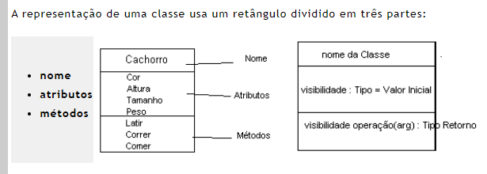
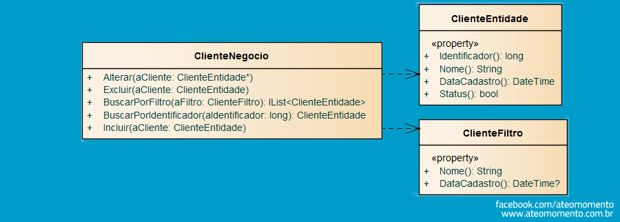

# Diagrama de Classes

#### Descobrindo a Orientação a Objetos

Entrando no mundo de orientação a objetos, deixamos de lado a ideia de ter funções, rotinas. Na verdade, vamos focar em objetos, métodos e propriedades;atributos.

A ideia de Orientação a Objetos, trata-se da ideia de utilizarmos este paradigma, que é a maneira como estruturamos o código, como pensamos e resolvemos o problema. Assim, a preocupação sai do foco em como o processo deve ser feito, mas passa a focar em quais objetos compõe o processo.

#### O que o diagrama de classes faz...

Um diagrama de classe serve para apresentar de forma estática como o sistema se parece, apresentando a estrutura deste sistema.

## Uma classe...

Uma classe representa um conjunto de informações, onde a mesma tem diversos atributos e métodos, que são respectivamente, suas caracterísitcas e ações.

### Atributos

Os atributos como informado anteriormente representam as características da classe, como por exemplo:

    Classe : Pessoa

    Atributos: Nome, Cpf, idade, Cidade

**A visbilidade de atributos**

    Atributos, assim como classes e métodos, possuem também visibilidade, neste caso, existem 3,

    + publico: qualquer classe pode acessar.

    # protegido: apenas classes do mesmo pacote acessam. (descendentes usam)

    - privado: somente a classe acessa.

## Relacionamento entre classes

Assim como em banco de dados, quando temos relacionamentos entre tabelas, temos também o relacionamento entre classes, que no caso da diagramação uml, temos diversos tipos, o quais estarão listados abaixo:

- Associação: Dividida em Agregação e Composta
- Herança
- Dependência
- 

##### Associação

Associações ocorrem entre classes ou objetos, por exemplo, uma classe professor que se relaciona com disciplina, onde uma instância de professor (um objeto do tipo professor) irá se associar com um objeto;instância de disciplina.

---

##### Dependência

Quando falamos neste tipo, isto indica que temos um objeto de uma classe X usando serviços de outra classe.

Aqui a direção é importante, por isso temos que, a ponta da seta aponta para quem é independente, já quem depend precisa de outras classes para existir, fica no início da seta.
