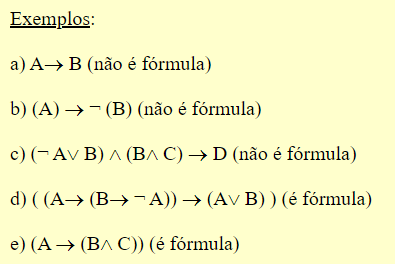

# Aula 02 - Fórmulas, Tautologia e Contradição

[link aula](https://youtu.be/Tex6tUKEPQA?list=PLrOyM49ctTx-HWypJVvn_zMO1o7oOAfVx)

### Fórmula Bem formulada (FBF)

Estamos falando de uma cadeia que expressa uma expressão válida. Segue abaixo uma fórmula bem formulada:

(A => B)^(B=>A)

Exemplo oposto (NÃO FBF):

A) => AB^^B

**Ordem de aplicação dos conectivos lógicos**

Assim como o PEMDAS (Parênteses, expoente,multiplicação, divisão, adição e subtração), temos uma ordem para resolver as expressão, confira a ordem:

¬ - negação

∧,∨ - and, or

⇒ - se então

⇔ - se e somente se

**Tautologia**

Tautologia indica que o resultado final da expressão será, independentemente das entradas, sempre VERDADEIRO.

Ex: A^¬A

Gabriel é feliz ou não é feliz.

A- Gabriel é feliz

¬A- Gabriel não é feliz.

Exemplo: Gabriel é feliz ou não é feliz.

**Contradição**

Já contradição é o oposto, e aponta um resultado que sempre será FALSO.

Ex: A∨¬A

A-Gabriel está feliz

¬A-Gabriel não está feliz.

Exemeplo: Gabriel está feliz e não está feliz.

# Exercícios

Vamos praticar um pouco com exercícios de FBF (Fórmula Bem Formulada).

1. Represente as seguintes proposições utilizando a linguagem da lógica clássica proposicional. Utilize os símbolos proposicionais C (está chovendo) e N (está nevando).

    a) Está chovendo, mas não está nevando.

    b) Não é o caso que está chovendo ou nevando.

    c) Se não está chovendo, então está nevando.

    d) Não é o caso que se está chovendo então está nevando.

    e) Está chovendo se e somente se está nevando.

    f) Se está nevando e chovendo, então está nevando.

    g) Se não está chovendo, então não é o caso que está nevando e chovendo.

Resposta
